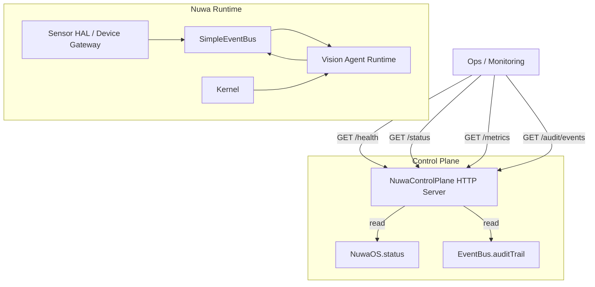

# MVP Iteration 02：控制面 + 审计能力

## 本次目标

在现有“可观测性基线”之上，补齐 MVP 的控制面能力：

- 通过 HTTP 提供健康检查与运行状态。
- 提供 Prometheus 风格 metrics。
- 暴露审计事件入口，支持快速排障。

## 产品概念图（Product Concept）

```mermaid
flowchart LR
  A[Operator / SRE] --> B[Nuwa Control Plane]
  C[Dashboard / Alerting] --> B
  D[CI Audit Job] --> B

  B --> E[/health]
  B --> F[/status]
  B --> G[/metrics]
  B --> H[/audit/events]

  E --> I[Runtime Health]
  F --> J[NuwaOS Status]
  G --> K[Prometheus Metrics]
  H --> L[Event Audit Trail]
```

## 架构图（Architecture）



## 端点说明

- `GET /health`：返回运行健康状态（`ok/degraded`）。
- `GET /status`：返回 NuwaOS 全量状态快照。
- `GET /metrics`：返回 Prometheus 文本指标。
- `GET /audit/events?limit=20`：返回最近审计记录。

## 验证与审计

- 功能验证：新增 `control-plane.test.ts` 覆盖所有核心端点。
- 审计验证：检查 `/audit/events` 输出记录非空且结构可解析。

## 下一步（Iteration 03）

- 按 topic 维度聚合吞吐与错误。
- 增加告警阈值策略（error burst / unmatched burst）。
- 引入 traceId/correlationId 打通端到端追踪。
